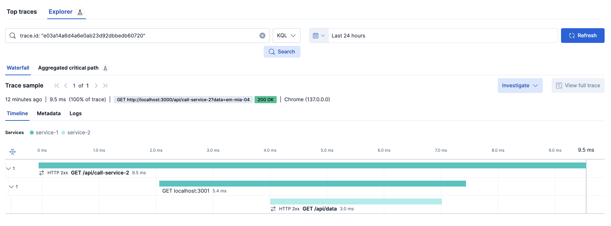
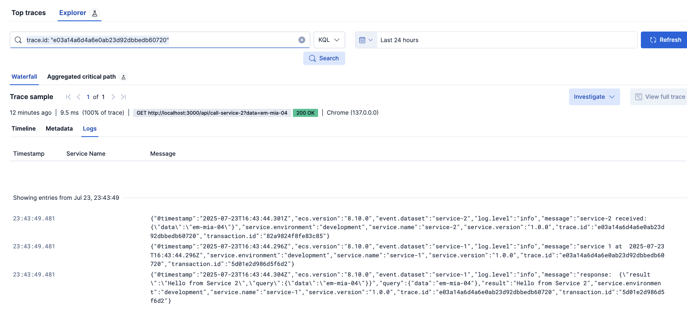
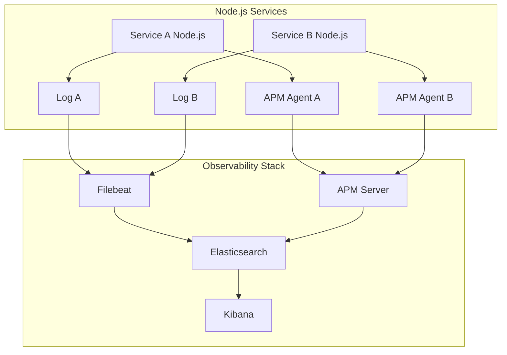

# Elastic APM

Use the [template](https://github.com/deviantony/docker-elk)





## Architecture



## Setup

All in one:
```shell
sh setup.sh 
```

```shell
docker compose up setup
docker compose -f docker-compose.yml -f extensions/filebeat/filebeat-compose.yml up -d
docker compose -f docker-compose.yml -f extensions/filebeat/filebeat-compose.yml restart filebeat
```

## Node apm example

elastic-apm
```json
{
  "name": "source-service",
  "version": "1.0.0",
  "description": "",
  "main": "index.js",
  "scripts": {
    "start": "node index.js"
  },
  "keywords": [],
  "author": "",
  "license": "ISC",
  "dependencies": {
    "@elastic/ecs-winston-format": "^1.5.3",
    "axios": "^1.9.0",
    "elastic-apm-node": "^4.13.0",
    "express": "^5.1.0",
    "ultimate-express": "^1.4.10",
    "winston": "^3.17.0",
    "winston-daily-rotate-file": "^5.0.0"
  }
}
```

.env
```
ELASTIC_APM_SERVICE_NAME=service-name
ELASTIC_APM_SERVER_URL=http://127.0.0.1:8200
```

service
```js
// Start the agent before any thing else in your app
const apm = require('elastic-apm-node').start()

require('winston-daily-rotate-file');
const { ecsFormat } = require('@elastic/ecs-winston-format');
const winston = require('winston');

const combineMessageWithUserMetaFormat = winston.format((info) => {
  const { message } = info;

  if (typeof message === "string" && info[Symbol.for('splat')]?.length) {
    for (const arg of info[Symbol.for('splat')]) {
      if (typeof arg === "string") {
        info.message = info.message + " " + arg;
      } else {
        info.message = info.message + " " + JSON.stringify(arg);
      }
    }
  }

  return info;
});

const logger = winston.createLogger({
  format: winston.format.combine(
    // combineMessageWithUserMetaFormat(),
    winston.format.errors({ stack: true }),
    winston.format.json(),
    ecsFormat({
      convertReqRes: true,
      apmIntegration: true,
    })
  ),
  transports: [
    new winston.transports.Console(),
    new winston.transports.DailyRotateFile({
      filename: '/var/tmp/services-logs/service-1/logs-%DATE%.log',
      datePattern: 'YYYY-MM-DD',
      zippedArchive: true,
      maxSize: '20m',
      maxFiles: '14d',
    })
  ]
});

// Create a Morgan-compatible stream that writes to Winston
const morganStream = {
  write: (message) => {
    // Remove the newline that Morgan adds to the end of each log
    const trimmedMessage = message.trim();
    logger.info('HTTP Access Log', {
      type: 'access_log',
      http_log: trimmedMessage
    });
  }
};

export { morganStream };
export default logger;

const express = require('express');
const axios = require('axios');
const http = require('http');
import morganLogger from 'morgan';

const httpAgent = new http.Agent({ keepAlive: true, keepAliveMsecs: 3000, maxSockets: 2, maxTotalSockets: 4 });

const axiosInstance = axios.create({
  httpAgent,
});

const app = express();
const port = 3000;

app.use(morganLogger('short', { stream: morganStream }));

app.get('/api/call-service-2', async (req, res) => {
  const { query } = req;
  logger.info("service 1 at ", new Date().toISOString());
  const response = await axiosInstance.get('http://localhost:3001/api/data', { params: query })
  logger.info("response: ", response.data);
  res.send({ response: response.data });
});

app.listen(port, () => {
  console.log(`Server is running at http://localhost:${port}`);
});
```
